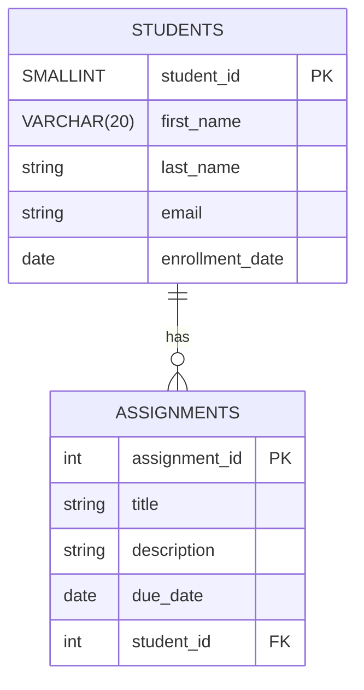

```mermaid
erDiagram
    STUDENTS {
        SMALLINT student_id PK
        VARCHAR(20) first_name
        string last_name
        string email
        date enrollment_date
    }
    ASSIGNMENTS {
        int assignment_id PK
        string title
        string description
        date due_date
        int student_id FK
    }
    STUDENTS ||--o{ ASSIGNMENTS : "has"

```
