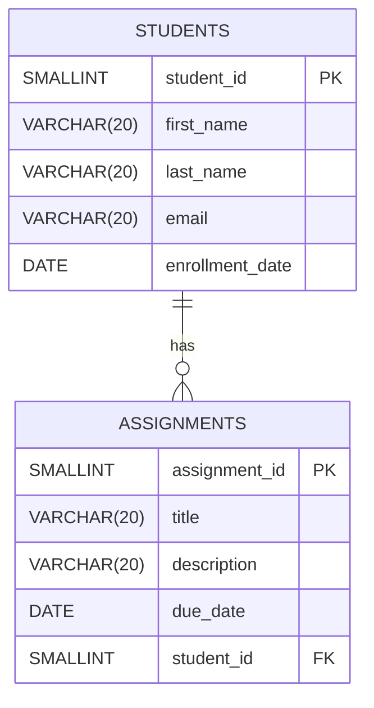

```mermaid
erDiagram
    STUDENTS {
        SMALLINT student_id PK
        VARCHAR(20) first_name
        VARCHAR(20) last_name
        VARCHAR(20) email
        DATE enrollment_date
    }
    ASSIGNMENTS {
        SMALLINT assignment_id PK
        VARCHAR(20) title
        VARCHAR(20) description
        DATE due_date
        SMALLINT student_id FK
    }
    STUDENTS ||--o{ ASSIGNMENTS : "has"

```
