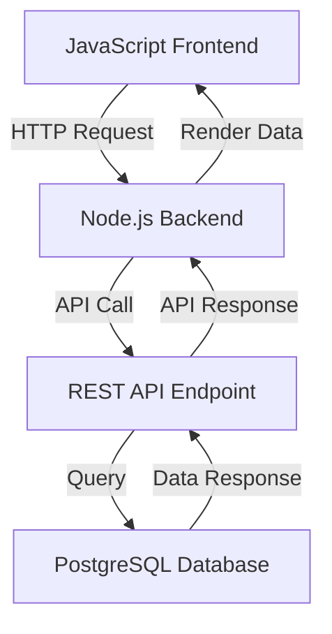
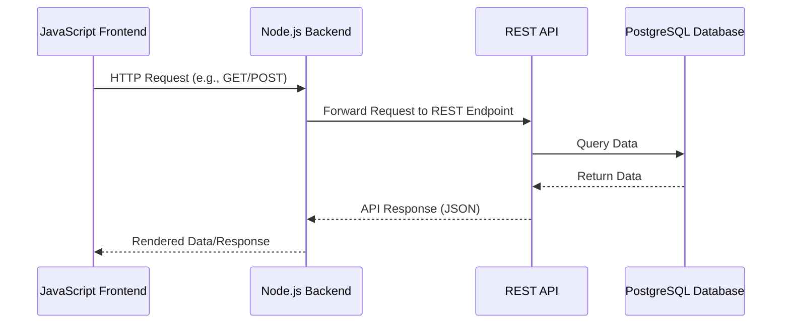

```mermaid
flowchart TD
    A[JavaScript Frontend] -->|HTTP Request| B[Node.js Backend]
    B -->|API Call| C[REST API Endpoint]
    C -->|Query| D[PostgreSQL Database]
    D -->|Data Response| C
    C -->|API Response| B
    B -->|Render Data| A
```

```mermaid
sequenceDiagram
    participant Frontend as JavaScript Frontend
    participant Backend as Node.js Backend
    participant API as REST API
    participant Database as PostgreSQL Database

    Frontend->>Backend: HTTP Request (e.g., GET/POST)
    Backend->>API: Forward Request to REST Endpoint
    API->>Database: Query Data
    Database-->>API: Return Data
    API-->>Backend: API Response (JSON)
    Backend-->>Frontend: Rendered Data/Response
```
