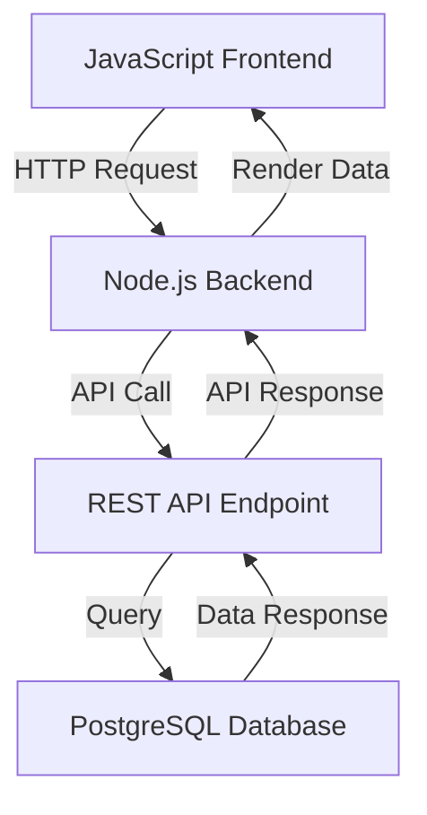

```mermaid
flowchart TD
    A[JavaScript Frontend] -->|HTTP Request| B[Node.js Backend]
    B -->|API Call| C[REST API Endpoint]
    C -->|Query| D[PostgreSQL Database]
    D -->|Data Response| C
    C -->|API Response| B
    B -->|Render Data| A
```
